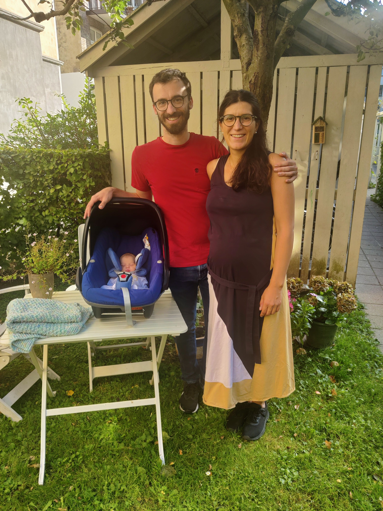
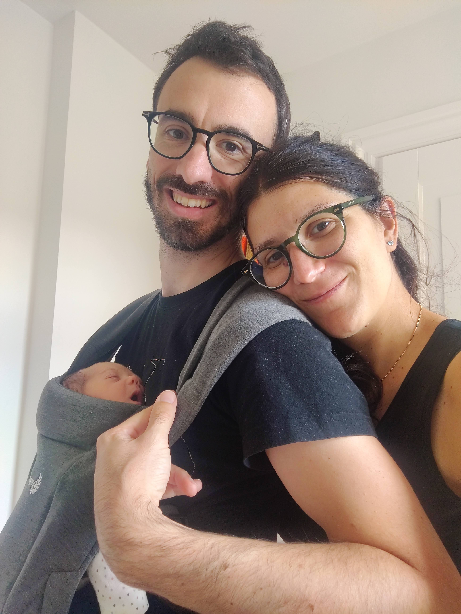

## Un messaggio da Copenaghen 

Carə amicə,

In tanti ci avete chiesto di cosa possiamo aver bisogno per la nostra Luna.     
Grazie ❤️ 
É bellissimo sentire tanto affetto dall'Italia!

Ci abbiamo pensato ma non siamo riusciti a trovare cose da farci regalare che possano esserci utili in questo momento. In Danimarca c'è un grande mercato dell'usato e ce ne stiamo servendo molto. Da un lato é un risparmio economico e dall'altro ci piace l'idea di non comprare vestiti e accessori nuovi che userà poco perché crescerà in fretta. 

In futuro ci saranno alcune spese grosse che dovremo affrontare. Per esempio vorremmo passare qualche mese in Italia per farvi conoscere Luna. Probabilmente in quell'occasione dovremo affittare un appartamento. Se sará necessario, abbiamo anche intenzione di farci aiutare da una consulente del sonno per aiutare Luna a dormire bene. Qui a Copenaghen ci concederemo ogni tanto una baby sitter visto che non avremo l'aiuto costante dei nonni.

Sappiamo bene che regalare soldi é un po' impersonale, ma contribuire a queste spese é probabilmente il modo più utile di aiutarci. Lasciamo il nostro IBAN in fondo alla pagina. 

Se preferite un pensiero piu' personale, un'altra cosa di cui abbiamo bisogno sono libri in Italiano (per la crescita). Quelli non li troviamo facilmente qui! 

Grazie ancora. Non vediamo l'ora di presentarvi Luna. 

Laura e Marco (e Luna!)

### Coordinate bancarie

Intestatario: Laura Alessandretti    
IBAN: IT88J0306930870100000064994    
WhatsApp: +45 50168709  (Apprezziamo molto una dedica/messaggio per Luna)    

### Indirizzo (per evenutali spedizioni)
Laura Alessandretti e Marco De Nadai    
Yrsavej 15, 2 tv.    
2000 Frederiksberg    
Denmark    

